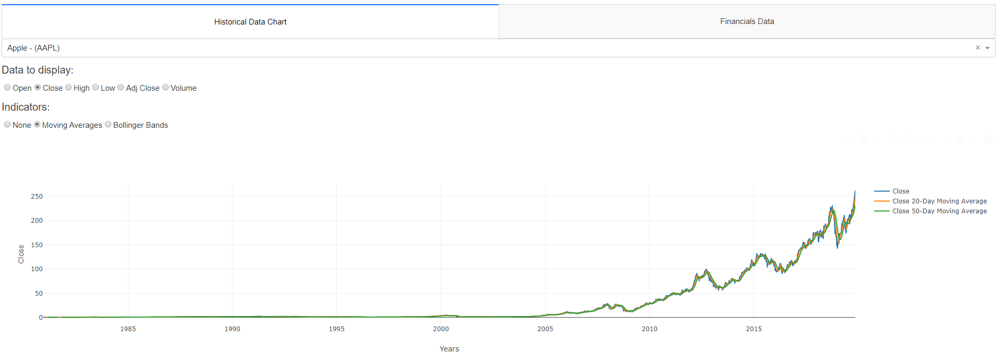
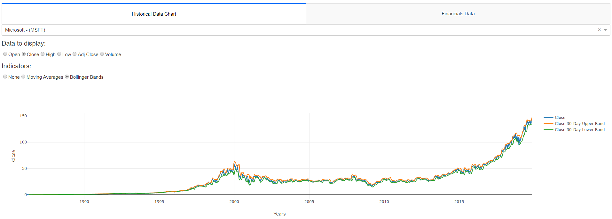

# Yahoo Web Scraping - Dashboard

This repository contains a dashboard for displaying stock data written in Python with the Dash package. Common stock data such as open and close prices as well as simple technical indicators (moving averages, bollinger bands) are implemented.

Requirements:
- dash
- plotly
- pandas
- selenium

Components: \
Files:
- app.py | Contains dashboard to display historical data + financial data (open Chrome on displayed IP address to access Dashboard)
- download_stocks.py | Downloads all the stocks specified in the dictionary of the file at the top
- scraper.py | Script containing class which scrapes stock data from Yahoo using Google Chrome

Folders:
- data | Contains both historical and financial fundamentals data as .csv files

### Moving average for AAPL

### Bollinger bands for MSFT

